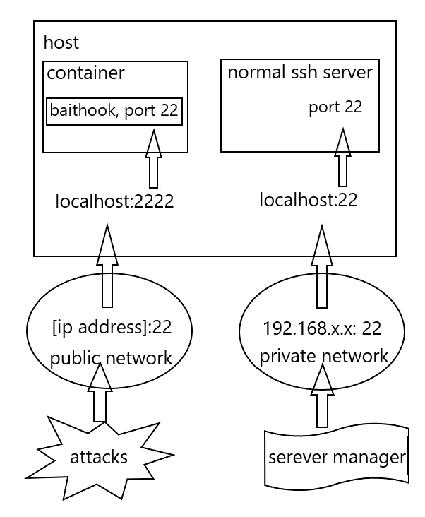

  
Get username and password dictionary from ssh brute-force attacks.
# How it works
We replace the important function `auth_password()` (in openssh source code) with a specialized one.  
So, when brute-force attack comes, it will refuse all connections and record username & password to file.  
**IMPORTANT: This can NOT be a common ssh server, it will Refuse All Connections!**
# Quick start
For example, you can make your network like this:  
  
This will make attack goes into Baithook, so that Baithook can record dictionary.  
## Commonly
For re-exec, use `${runsh}` is ok (defined in `build.sh`, default `/run.sh`).  
Dictionary file will be at `/dict.txt`, and ip-address file will be at `/addr.txt`.  
## For docker
`docker run -p 22:22 -itd catium/baithook:latest`  
Make sure port `22` is forwarded.  
## File format
+ Dictionary file format is like this:
```
username pa$$w0rd
admin admin114514
nginx nginx
```
+ ip-address file format is like this(ipv6 is never tested):
```
127.0.0.1
192.168.4.5
6.7.8.9
```
# Build by your self
Or... [docker image](https://hub.docker.com/r/catium/baithook)?
## Environment
You need a container to build or run Baithook.  
As for me, I chose Docker with image `ubuntu:22.04`.  
*make sure your software source is available*  
## Installation
1. uncompress the zip file(of course in container).  
2. `sudo chmod u+x build.sh`  
3. `sudo ./build.sh`  

The `build.sh` will automaticly install things below:
+ c complier
+ zlib.
+ openssl(v1.1).
+ libperl-dev (on ubuntu)
+ baithook.

When everything is done, you will have a `${runsh}` file and some other file in `${installDir}`.  
### Customize
edit `build.sh`, there are two variables.
+ `${pm}` default is auto detected, software package manager.
+ `${cc}` default is `gcc`, c complier.
+ `${zlib}` default is `zlib-1.2.12`, version of zlib (effectes only on ubuntu).
+ `${openssl}` default is `openssl-1.1.1h`, version of openssl, *must be openssl-1.1* (effectes only on ubuntu).
+ `${openssh}` default is `openssh-9.0p1`, version of openssh to be based on.
+ `${installpath}` default is `/baithook`, path to install baithook.
+ `${runsh}` default is `/run.sh`, what command you want to use as container's daemon.
+ `${job}` defalut is 4, make -j ${job}.

# Licence
[Licence of OpenSSH](LICENCE)